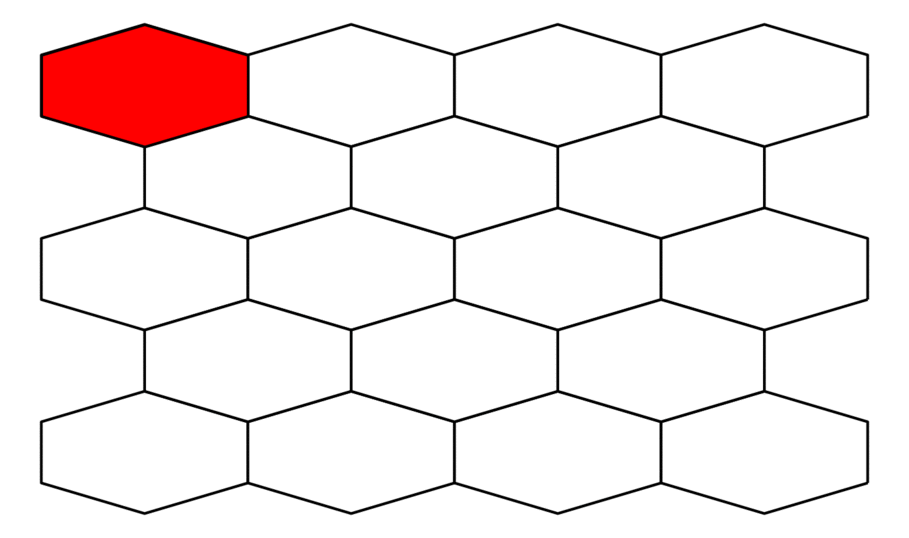

# `spacv`: spatial cross-validation in Python

`spacv` is a small Python 3 (3.6 and above) package for cross-validation of models
that assess generalization performance to datasets with spatial dependence. `spacv` provides
a familiar sklearn-like API to expose a suite of tools useful for points-based spatial prediction tasks.
See the notebook `spacv_guide.ipynb` for usage.


<p align="center">

</p>

CURRENTLY UNDER CONSTRUCTION

## Dependencies

* `numpy`
* `matplotlib`
* `pandas`
* `geopandas`
* `shapely`

## Installation and usage

To install use pip:

    $ pip install

Then build quick spatial cross-validation workflows as:

```python
import spacv
import geopandas as gpd
from sklearn.model_selection import cross_val_score
from sklearn.svm import SVC

df = gpd.read_file('data/baltim.geojson')

XYs = df['geometry']
X = df[['NROOM', 'BMENT', 'NBATH', 'PRICE', 'LOTSZ', 'SQFT']]
y = df['PATIO']

skcv = spacv.SKCV(n_splits=4, buffer_radius=10).split(XYs)

svc = SVC()

cross_val_score(svc, 
                X, 
                y, 
                cv = skcv)
```
